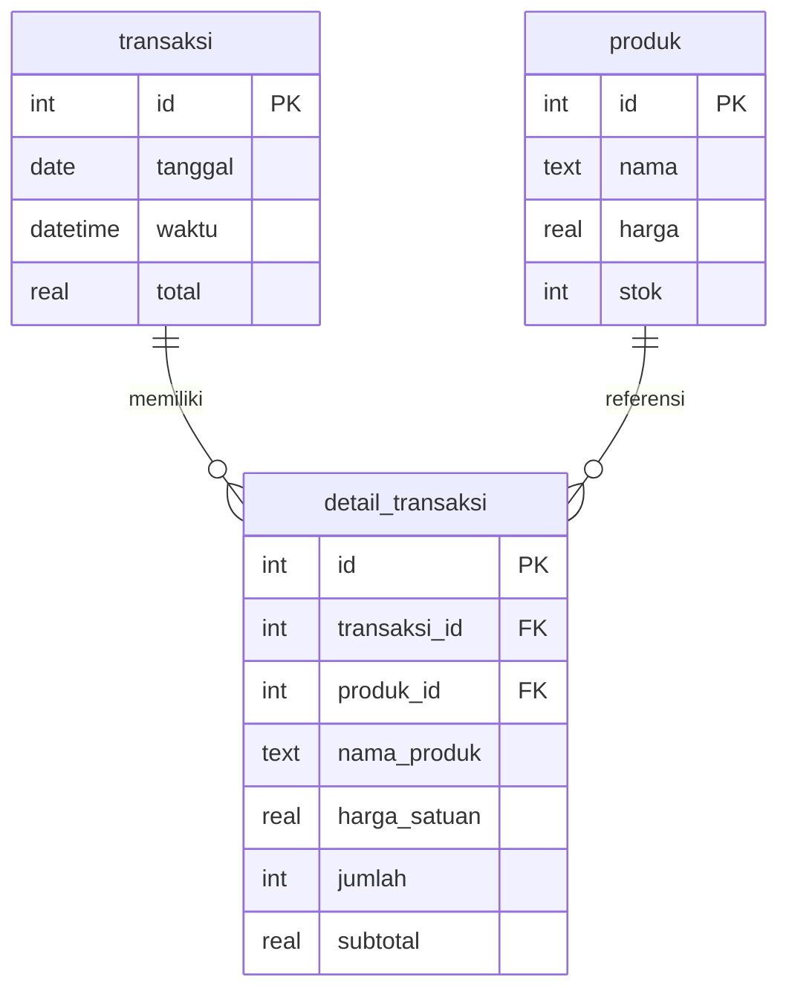

<div align="center">

# 📠 KasirPro

### Aplikasi Kasir Sembako — Desktop POS System

[](https://www.electronjs.org/)
[](https://www.sqlite.org/)
[](https://github.com/)
[](LICENSE)

Aplikasi **Point of Sale (POS)** desktop ringan untuk toko sembako dan retail kecil. Dibangun dengan **Electron** + **SQLite**, berjalan offline tanpa perlu server atau internet.

</div>

---

## ✨ Fitur Utama

| Fitur | Keterangan |
|-------|------------|
| 🔍 **Pencarian Produk Cepat** | Cari barang secara real-time dari katalog, langsung tambahkan ke keranjang |
| 🛒 **Keranjang Belanja** | Kelola item, ubah kuantitas, hapus item, dengan empty state informatif |
| 💳 **Proses Pembayaran** | Input nominal, tombol cepat (5K–100K), hitung kembalian otomatis |
| 🧾 **Cetak Struk** | Preview struk dan cetak langsung, identitas toko dapat dikonfigurasi |
| 📦 **Manajemen Stok** | Tambah, edit, hapus produk. Badge status stok (Ada/Sisa/Habis) |
| 📊 **Laporan Penjualan** | Omzet harian, bulanan, filter tanggal, detail item per transaksi |
| 📤 **Ekspor CSV** | Export data transaksi ke file CSV dengan dialog simpan |
| 🌙 **Dark Mode** | Toggle mode gelap/terang, tersimpan otomatis |
| ⌨️ **Keyboard Shortcut** | F8 (fokus bayar), Enter (proses), Escape (tutup modal) |
| 🏪 **Konfigurasi Toko** | Ubah nama toko, alamat, kode pos langsung dari Pengaturan |
| 🔒 **Context Isolation** | Keamanan Electron modern — renderer terisolasi dari Node.js |

---

## 📸 Screenshot

> _Tambahkan screenshot aplikasi di sini setelah menjalankan._
>
> ```
> npm start
> ```
> Lalu tekan `Print Screen` atau gunakan Snipping Tool.

---

## 🏗️ Arsitektur

```
┌──────────────────────────────────────────────────────────┐
│                      Electron App                         │
│                                                           │
│  ┌──────────┐  preload.js   ┌──────────────────────────┐ │
│  │ main.js  │──────────────→│  index.html + renderer.js│ │
│  │ (Main)   │  contextBridge│  (Renderer Process)      │ │
│  │          │←── IPC ──────→│  window.api.*            │ │
│  │          │               └──────────────────────────┘ │
│  │          │                                            │
│  │  ┌───────┴────────┐                                   │
│  │  │ SQLite DB      │                                   │
│  │  │ (kasirpro.db)  │                                   │
│  │  └────────────────┘                                   │
│  └──────────┘                                            │
└──────────────────────────────────────────────────────────┘
```

**Prinsip keamanan:**
- `nodeIntegration: false` — renderer **tidak bisa** akses Node.js
- `contextIsolation: true` — renderer terisolasi dari main process
- `preload.js` + `contextBridge` — hanya IPC channel yang diizinkan yang terekspos
- Semua operasi database terjadi di **main process**
- Pencegahan XSS — `escapeHTML()` + `textContent` untuk semua konten dinamis

---

## 📁 Struktur Proyek

```
KasirSembako/
│
├── main.js              → Electron main process (DB, IPC handlers)
├── preload.js           → Context bridge (window.api)
├── renderer.js          → Orchestrator (namespace, helpers, event wiring)
│
├── js/                  → Modul bisnis (IIFE pattern)
│   ├── cart.js          → Keranjang, pembayaran, struk, pencarian
│   ├── product.js       → CRUD produk, manajemen stok
│   └── report.js        → Laporan, filter tanggal, ekspor CSV
│
├── styles.css           → Seluruh CSS (light + dark mode)
├── index.html           → UI tunggal (SPA-like, modal-based)
│
├── forge.config.js      → Konfigurasi Electron Forge
├── package.json         → Dependencies & metadata
├── assets/
│   └── icon.ico         → Ikon aplikasi
└── PROJECT_INDEX.md     → Dokumentasi teknis internal
```

---

## 🚀 Cara Menjalankan

### Prasyarat

- **Node.js** ≥ 18.x ([Download](https://nodejs.org/))
- **npm** ≥ 9.x (termasuk dalam Node.js)
- **Windows** 10/11 (untuk build installer)
- **Build Tools:** `windows-build-tools` atau Visual Studio Build Tools (diperlukan untuk kompilasi SQLite native module)

### Instalasi

```bash
# 1. Clone repository
git clone https://github.com/<username>/KasirSembako.git
cd KasirSembako

# 2. Install dependencies
npm install

# 3. Jalankan aplikasi (mode development)
npm start
```

### Build Installer (.exe)

```bash
# Build installer Windows (Squirrel)
npm run make
```

Output installer akan berada di folder `out/make/squirrel.windows/`.

### Script Tersedia

| Script | Perintah | Keterangan |
|--------|----------|------------|
| `npm start` | `electron-forge start` | Jalankan mode development |
| `npm run package` | `electron-forge package` | Package tanpa installer |
| `npm run make` | `electron-forge make` | Build installer Windows |

---

## 💾 Database

### Lokasi File

```
%APPDATA%/KasirProData/kasirpro.db
```

Database dibuat otomatis saat pertama kali aplikasi dijalankan. Tidak perlu setup manual.

### Skema

```sql
-- Tabel Produk
CREATE TABLE produk (
    id    INTEGER PRIMARY KEY AUTOINCREMENT,
    nama  TEXT,
    harga REAL,
    stok  INTEGER
);

-- Tabel Transaksi (header)
CREATE TABLE transaksi (
    id      INTEGER PRIMARY KEY AUTOINCREMENT,
    tanggal DATE DEFAULT (DATE('now','localtime')),
    waktu   DATETIME DEFAULT (DATETIME('now','localtime')),
    total   REAL
);

-- Tabel Detail Transaksi (item per transaksi)
CREATE TABLE detail_transaksi (
    id            INTEGER PRIMARY KEY AUTOINCREMENT,
    transaksi_id  INTEGER NOT NULL,
    produk_id     INTEGER,
    nama_produk   TEXT NOT NULL,
    harga_satuan  REAL NOT NULL,
    jumlah        INTEGER NOT NULL,
    subtotal      REAL NOT NULL,
    FOREIGN KEY (transaksi_id) REFERENCES transaksi(id),
    FOREIGN KEY (produk_id) REFERENCES produk(id)
);
```

### Relasi Tabel



---

## 🔌 IPC API Reference

Semua komunikasi antara renderer dan main process menggunakan IPC (Inter-Process Communication):

| Channel | Parameter | Return | Keterangan |
|---------|-----------|--------|------------|
| `db:search-produk` | `keyword: string` | `Array<{id, nama, harga, stok}>` | Cari produk (stok > 0, limit 6) |
| `db:get-all-produk` | `keyword: string` | `Array<{id, nama, harga, stok}>` | Semua produk (untuk manajemen stok) |
| `db:insert-produk` | `{nama, harga, stok}` | `{lastID, changes}` | Tambah produk baru |
| `db:update-produk` | `{id, nama, harga, stok}` | `{lastID, changes}` | Edit produk |
| `db:delete-produk` | `id: number` | `{lastID, changes}` | Hapus produk |
| `db:proses-transaksi` | `{total, items[]}` | `{success, transaksiId}` | Simpan transaksi + detail + kurangi stok |
| `db:get-laporan` | `{tglAwal?, tglAkhir?}` | `{omzet, count, riwayat[]}` | Ambil data laporan |
| `db:get-detail-transaksi` | `transaksiId: number` | `Array<{nama_produk, harga_satuan, jumlah, subtotal}>` | Detail item per transaksi |
| `db:get-omzet-bulan` | — | `number` | Omzet bulan berjalan |
| `db:ekspor-csv` | `{tglAwal?, tglAkhir?}` | `{success, message}` | Ekspor transaksi ke CSV |
| `db:reset-database` | — | `{success: true}` | Reset seluruh database |

---

## ⌨️ Keyboard Shortcut

| Shortcut | Aksi |
|----------|------|
| `F8` | Fokus ke input pembayaran |
| `Enter` | Proses pembayaran (saat di input bayar) |
| `Escape` | Tutup modal yang sedang terbuka |

---

## 🎨 Design System

### Warna

| Variable CSS | Hex | Kegunaan |
|-------------|-----|----------|
| `--aksen` | `#6366f1` | Primary (Indigo) |
| `--aksen-hover` | `#4f46e5` | Primary hover |
| `--sukses` | `#10b981` | Sukses / hijau |
| `--bahaya` | `#ef4444` | Bahaya / merah |
| `--peringatan` | `#f59e0b` | Warning / kuning |
| `--bg` | `#f8fafc` | Background |
| `--panel` | `#ffffff` | Card / panel |
| `--teks-gelap` | `#0f172a` | Teks utama |
| `--teks-terang` | `#64748b` | Teks sekunder |

### Font

| Penggunaan | Font | Weight |
|-----------|------|--------|
| UI | Plus Jakarta Sans | 400, 600, 800 |
| Monospace (jam, struk) | JetBrains Mono | 500 |

### Dark Mode

Dark mode diaktifkan melalui class `body.dark-mode`. Semua CSS variable di-override menggunakan selector `body.dark-mode`. Preferensi tersimpan di `localStorage` dengan key `kasirpro-dark`.

---

## 🛡️ Keamanan

| Aspek | Implementasi |
|-------|-------------|
| **Context Isolation** | `contextIsolation: true`, `nodeIntegration: false` |
| **IPC Bridge** | `preload.js` + `contextBridge` — hanya whitelist channel |
| **XSS Prevention** | `escapeHTML()` untuk konten dinamis, `textContent` untuk plain text |
| **CSP** | Content-Security-Policy header di `<meta>` tag |
| **No Remote Code** | Tidak ada eval, remote module, atau dynamic require |
| **DB Isolation** | Database di main process saja, renderer akses via IPC |

---

## 📦 Dependencies

### Production

| Package | Versi | Fungsi |
|---------|-------|--------|
| `sqlite3` | ^5.0.2 | Database lokal |
| `electron-squirrel-startup` | ^1.0.1 | Handler shortcut saat install/uninstall |

### Development

| Package | Versi | Fungsi |
|---------|-------|--------|
| `electron` | ^40.6.1 | Runtime desktop |
| `@electron-forge/cli` | ^7.6.1 | Build toolchain |
| `@electron-forge/maker-squirrel` | ^7.6.1 | Windows installer (.exe) |
| `@electron-forge/maker-zip` | ^7.11.1 | ZIP portable |
| `@electron-forge/plugin-auto-unpack-natives` | ^7.11.1 | Native module handler |

---

## 📖 Panduan Penggunaan

### 1. Dashboard (Kasir)

1. Ketik nama barang di **kolom pencarian** — hasil muncul secara real-time
2. Klik item untuk menambahkan ke **keranjang**
3. Ubah jumlah (qty) langsung di tabel keranjang
4. Masukkan **nominal pembayaran** atau gunakan tombol nominal cepat
5. Klik **BAYAR SEKARANG** atau tekan `Enter`
6. Preview struk akan muncul — pilih **Cetak** atau **Tidak**

### 2. Manajemen Stok

1. Klik **📦 Stok Barang** di sidebar atau tombol **+ Tambah Barang**
2. Lihat semua produk dengan badge status stok
3. **Tambah** — isi nama, harga, stok → Simpan
4. **Edit** — klik ✏️ pada produk
5. **Hapus** — klik 🗑️ pada produk

### 3. Laporan

1. Klik **📊 Laporan** di sidebar
2. Lihat **omzet hari ini**, **omzet bulan ini**, dan **total transaksi**
3. Gunakan **filter tanggal** untuk rentang tertentu
4. Klik **👁️ Detail** pada transaksi untuk melihat item per transaksi
5. Klik **Ekspor CSV** untuk export data

### 4. Pengaturan

1. Klik **⚙️ Pengaturan** di sidebar
2. **Tampilan** — toggle dark mode / light mode
3. **Identitas Toko** — ubah nama, alamat, kode pos (digunakan di struk)
4. **Keyboard Shortcut** — referensi cepat shortcut
5. **Reset Database** — hapus seluruh data (⚠️ tidak bisa dibatalkan)

---

## 🤝 Kontribusi

1. Fork repository ini
2. Buat branch fitur (`git checkout -b fitur/fitur-baru`)
3. Commit perubahan (`git commit -m 'Tambah fitur baru'`)
4. Push ke branch (`git push origin fitur/fitur-baru`)
5. Buat Pull Request

### Konvensi Kode

- **CSS Variables:** Bahasa Indonesia (`--aksen`, `--sukses`)
- **ID HTML:** camelCase (`searchInput`, `btnBayar`)
- **Fungsi JS:** camelCase, Bahasa Indonesia (`tampilNotif`, `loadStok`)
- **Tabel DB:** lowercase, Bahasa Indonesia (`produk`, `transaksi`)
- **IPC Channel:** `db:<aksi-kebab-case>` (`db:search-produk`)

---

## 📄 Lisensi

Proyek ini dilisensikan di bawah lisensi **ISC**.

---

## 👨‍💻 Author

**Hendri .O**

---

<div align="center">

_Dibuat dengan ❤️ menggunakan Electron + SQLite_

</div>
